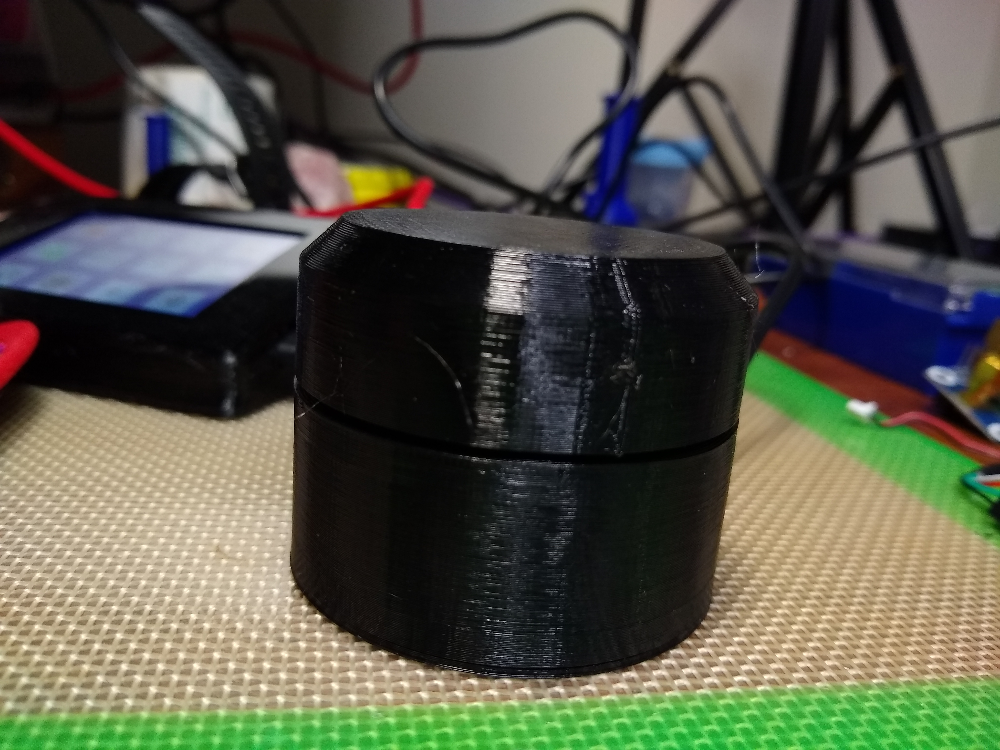

# Media-Knob based off a Pro Micro 32u4 board
Working Rotary Encoder HID knob that can be built on easily! 

Had a few hiciups finding something basic that just worked and could be build upon in the future. Went with this sketch and case after some tinkering time.

Print will take both UBS Micro and C style Pro Micro boards. 

The write up is good as well for their use case.

# Note: Use Analog inputs for encoder knob.

## https://www.thingiverse.com/thing:2810760

!

